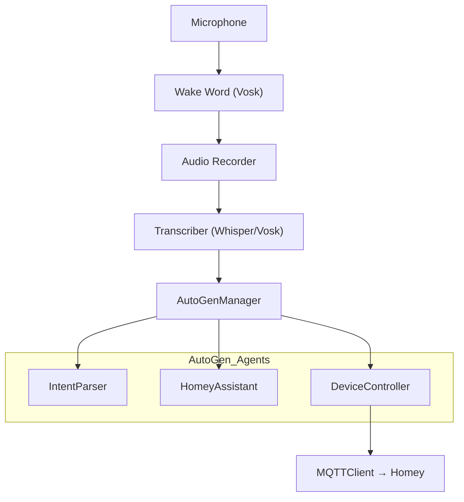

# HomeyMind

HomeyMind is a voice-controlled AI assistant for Homey smart home systems. It uses natural language processing to understand and execute voice commands for controlling your Homey devices.

## Features

- Voice command recognition using wake word detection
- Natural language processing for understanding commands
- MQTT integration with Homey
- Support for multiple AI models (local and cloud-based)
- Automatic device discovery and mapping
- Voice feedback for command execution

## Prerequisites

- Python 3.8 or higher =< 3.12
- Homey Pro with MQTT enabled
- OpenAI API key (optional, for cloud-based AI)
- Microphone for voice input
- Speakers for voice output

## Installation

1. Clone the repository:
```bash
git clone https://github.com/yourusername/HomeyMind.git
cd HomeyMind
```

2. Create and activate a virtual environment:
```bash
# On Windows:
python -m venv homeymind
.\homeymind\Scripts\activate

# On Linux/Mac:
python -m venv homeymind
source homeymind/bin/activate
```

3. Install dependencies:
```bash
pip install -r requirements.txt
```

4. Copy the example configuration:
```bash
cp config.example.yaml config.yaml
```

5. Create a `.env` file with your credentials:
```bash
cp .env.example .env
```

6. Run the application:
```bash
# On Windows:
.\run.bat

# On Linux/Mac:
python main.py
```

7. Edit `config.yaml` with your settings:
```yaml
homey:
  host: "192.168.1.x"  # Your Homey's IP address

llm:
  provider: local      # Options: local, openai, groq
  local_model: mistral
  cloud_model: gpt-4o
  groq_model: llama3-8b-8192

audio:
  wake_word: topper
  record_seconds: 5
  language: nl

mqtt:
  topic_prefix: ai/
  host: "192.168.1.x"  # Same as homey.host
  port: 1883
```

## Additional Setup

### 1. Install Vosk Speech Model

```bash
mkdir models
curl -L -o vosk-model-nl.zip https://alphacephei.com/vosk/models/vosk-model-nl-0.22.zip
tar -xf vosk-model-nl.zip -C models
mv models/vosk-model-nl-0.22 models/vosk-model-nl
```

Ensure the path is:
```
<project_path>/HomeyMind/models/vosk-model-nl
```

### 2. Install Local LLM (Optional)

If you want to run a local LLM:

```bash
ollama run mistral
```

Make sure this matches your `config.yaml`:
```yaml
llm:
  provider: local
  local_model: mistral
```

More models available at: https://ollama.com/library

### 3. MQTT Setup (Required)

The AI agent uses MQTT to communicate with Homey.

#### Recommended: Homey as MQTT Broker

Use the [MQTT Broker app](https://homey.app/nl-nl/app/nl.scanno.mqttbroker/MQTT-Broker/) on your Homey Pro:

1. Install the app on your Homey
2. Start the broker via the app
3. The broker listens on port `1883` by default
4. Update your `config.yaml` with Homey's IP:
```yaml
mqtt:
  host: 192.168.1.x  # Replace with your Homey's IP
  port: 1883
  topic_prefix: ai/
```

This allows direct communication between your AI agent and Homey without additional apps.

#### Alternative – Homey as MQTT Client:
1. Install the MQTT Client app in Homey
2. Configure your MQTT broker IP/port (e.g., `192.168.1.x:1883`)
3. Add a flow that listens to topic `ai/#`

#### Option B – Local MQTT Broker (Optional):

Install Mosquitto (Windows):
```bash
winget install mosquitto
```

Start the broker:
```bash
mosquitto -v
```

## Usage

1. Start the application:
```bash
python main.py
```

2. Say "Hey Topper" followed by your command.

3. The assistant will process your command and execute it through Homey.

## Available Commands

- Turn devices on/off: "Turn on the living room light"
- Dim lights: "Set the bedroom light to 50%"
- Switch AI modes: "Switch to local AI" or "Switch to cloud AI"
- Get status: "What's the status of the kitchen light?"

## Web Interface (Optional)

The `ui/` directory contains an optional local web interface built with Vite + React.

### Prerequisites
- Node.js and npm must be installed (https://nodejs.org)

### Installation and Startup

```bash
cd ui
npm install
npm install -D @vitejs/plugin-react  # if needed
npm run dev
```

Then visit: [http://localhost:5173](http://localhost:5173)

Note: This UI is optional and doesn't affect the voice agent's functionality.

## Security

- All sensitive credentials are stored in environment variables
- MQTT credentials are encrypted in transit
- No hardcoded secrets in the codebase
- Configuration files are excluded from version control

## Development

### Project Structure

```
HomeyMind/
├── audio/                  # Audio processing (wake word, recording, transcription)
├── homey/                  # Homey integration (MQTT client)
├── llm/                    # LLM integration (local and cloud models)
├── models/                 # Speech recognition models
├── prompts/               # AI prompts for intent recognition
├── tests/                 # Test utilities
│   ├── test_mic.py        # Microphone testing
│   └── test_mqtt.py       # MQTT testing
├── utils/                 # Helper functions and utilities
│   ├── capability_manager.py  # Device capability management
│   ├── device_list.py        # Device discovery and management
│   ├── device_types.yaml     # Device type definitions
│   └── intent_parser.py      # Intent recognition
├── config.yaml           # Configuration file
├── main.py               # Main application
└── requirements.txt      # Python dependencies
```

### Running Tests

---

## Architecture



---

## Roadmap

- [x] Wake word detection with Vosk
- [x] Streaming transcription (Whisper)
- [x] MQTT interaction with Homey
- [x] TTS for Sonos
- [x] Switching between local/cloud LLMs
- [x] OpenAI & Groq support
- [x] Memory and logging
- [x] Intent recognition
- [x] AutoGen agent swarm
- [ ] Improve intent recognition accuracy
- [ ] Improve Agent flow and user control
- [ ] Suggestions & autonomous actions
- [ ] Better error handling and recovery

## License

This project is licensed under the MIT License - see the LICENSE file for details.

## Acknowledgments

- Homey for their excellent smart home platform
- OpenAI for their language models
- The open-source community for various tools and libraries
