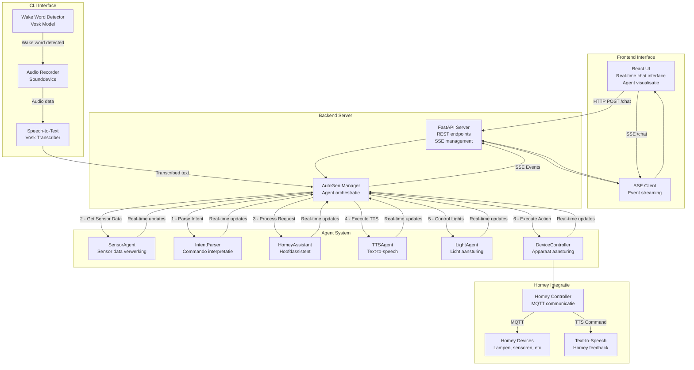

# HomeyMind

Een voice-gestuurde home automation assistent die Homey aanstuurt met behulp van LLMs en AutoGen agents.

## Features

* 🎤 Wake word detectie via CLI met Vosk ("Hey Homey")
* 🤖 LLM-gebaseerde intent herkenning (Ollama/OpenAI)
* 🏠 Homey integratie via MQTT
* 🔊 Text-to-Speech feedback via Homey
* 💡 Ondersteuning voor verschillende apparaten (lampen, thermostaat, etc.)
* 🧠 Geheugen voor apparaat status en voorkeuren

### Nieuwe UI Features

* 💬 Real-time chat interface met streaming responses
* 🔄 Live updates van agent communicatie
* 💭 Inzichtelijk denkproces van de agents
* 📱 Responsive design voor desktop en mobiel
* ⚡ Server-Sent Events voor snelle communicatie
* 🎯 Duidelijke weergave van gebruiker en assistent berichten
* 🕒 Tijdstempels voor alle berichten
* 🔍 Uitklapbaar denkproces voor debugging

## Vereisten

### Basis Vereisten
* Python 3.10 of hoger (getest tot 3.12)
* Node.js 18 of hoger
* npm 9 of hoger
* Git

### Externe Services
* LLM Provider (kies één):
  * Ollama (voor lokale LLM uitvoering)
  * OpenAI API key
* Homey Pro met MQTT Client app
* Vosk spraakherkenning model (Nederlands)

## Installatie

### 1. LLM Setup
Kies één van de volgende opties:

#### Optie A - Ollama (Lokaal)
1. Download en installeer Ollama van [ollama.ai](https://ollama.ai)
2. Pull het gewenste model:
```bash
ollama pull mistral
# OF voor betere prestaties
ollama pull mixtral
```

#### Optie B - OpenAI
1. Maak een account op [OpenAI](https://platform.openai.com)
2. Genereer een API key
3. Sla deze op in je `.env` bestand

### 2. Homey MQTT Setup
1. Installeer de "MQTT Client" app op je Homey
2. Gebruik de interne MQTT server van Homey OF installeer een externe MQTT broker
3. Configureer de MQTT Client app
4. Noteer de MQTT topics voor je apparaten

### 3. HomeyMind Setup

1. Clone de repository:
```bash
git clone https://github.com/ramonankersmit/homeymind.git
cd homeymind
```
2. Maak een virtual environment aan:
```bash
python -m venv venv

# Linux/macOS
source venv/bin/activate

# Windows
.\venv\Scripts\activate
```

3. Installeer Python dependencies:
```bash
pip install -r requirements.txt
```

4. Installeer frontend dependencies:
```bash
cd homeymind-ui/frontend
npm install
cd ../..
```
5. Configureer de applicatie:
```bash
cp config.example.yaml config.yaml
```

6. Bewerk `config.yaml` met je specifieke instellingen:
```yaml
# Kies je LLM provider
llm:
  # Optie A - Ollama
  provider: "ollama"
  model: "mistral"  # of "mixtral"
  base_url: "http://localhost:11434"
  
  # OF Optie B - OpenAI
  # provider: "openai"
  # model: "gpt-4"  # of "gpt-3.5-turbo"
  # api_key: "sk-..."  # of via OPENAI_API_KEY in .env

mqtt:
  broker: "localhost"  # of IP van je Homey voor interne MQTT server
  port: 1883
  username: ""  # indien nodig
  password: ""  # indien nodig
  
devices:
  - name: "Woonkamer Lamp"
    id: "light.living_room"
    type: "light"
  # Voeg meer apparaten toe zoals nodig
```

## CLI Features

Naast de web interface heeft HomeyMind voice interactie via de command line:

1. Start de voice assistent:
```bash
python main.py
```

2. Voice commando's:
* Wacht op "Hey Homey" wake word
* Spreek je commando in wanneer je "Oké, ik luister" hoort
* De assistent zal via Homey's Text-to-Speech antwoorden

3. Vereisten voor voice:
* Werkende microfoon (test met `python tests/test_mic.py`)
* Geïnstalleerd Vosk model in `models/vosk-model-nl`
* Geconfigureerde MQTT verbinding met Homey

## Opstarten

1. Start de backend server:
```bash
cd homeymind-ui/backend
uvicorn backend:app --reload
```

2. Start de frontend development server (in een nieuwe terminal):
```bash
cd homeymind-ui/frontend
npm run dev
```

3. Open de applicatie in je browser:
```
http://localhost:5173
```

## Gebruik

1. Open de applicatie in je browser
2. Type een bericht zoals:
   * "Zet het licht aan in de woonkamer"
   * "Wat is de temperatuur in de slaapkamer?"
   * "Dim de lamp in de keuken naar 50%"
3. Bekijk het denkproces van de agents
4. Volg de real-time updates
5. Zie de veranderingen direct op je Homey apparaten

## Development

### Tests Uitvoeren
```bash
pytest tests/
```

### Code Style
* Python: PEP 8 standaard
  ```bash
  black . ; isort . ; flake8
  ```
* JavaScript/React: Prettier
  ```bash
  cd homeymind-ui/frontend && npm run format
  ```

## Troubleshooting

### Veel Voorkomende Problemen

1. Ollama verbindingsproblemen:
   * Controleer of Ollama draait: `curl http://localhost:11434/api/tags`
   * Controleer het gekozen model: `ollama list`

2. MQTT verbindingsproblemen:
   * Controleer of de broker draait: `mosquitto_sub -t "test"`
   * Controleer firewall instellingen voor poort 1883

3. Homey verbindingsproblemen:
   * Controleer MQTT topics in de Homey app
   * Test verbinding: `mosquitto_pub -t "homey/test" -m "test"`

## Licentie

[MIT License](LICENSE)

## Project Structuur

```
homeymind/
├── app/                  # Core applicatie code
│   ├── core/            # Core functionaliteit
│   │   ├── llm_manager.py   # LLM integratie
│   │   └── memory.py        # Persistent storage
│   └── agents/          # Agent implementaties
│       ├── base_agent.py    # Basis agent klasse
│       ├── sensor_agent.py  # Sensor data verwerking
│       ├── tts_agent.py     # Text-to-speech verwerking
│       ├── light_agent.py   # Licht aansturing
│       ├── homey_assistant.py  # Hoofdassistent
│       ├── device_controller.py # Apparaat aansturing
│       ├── intent_parser.py    # Intent herkenning
│       └── autogen_manager.py  # Agent orchestratie
├── homeymind-ui/        # Frontend applicatie
│   ├── frontend/        # React frontend
│   │   └── src/         # Frontend broncode
│   └── backend/         # FastAPI backend
├── homey/               # Homey integratie
│   ├── mqtt_client.py       # MQTT communicatie
│   ├── device_list.py      # Apparaat management
│   └── intent_parser.py    # Intent parsing
├── audio/               # Audio verwerking
│   ├── recorder.py         # Audio opname
│   ├── transcriber.py      # Speech-to-text
│   └── wake_word_vosk.py   # Wake word detectie
├── tests/               # Test suite
└── docs/                # Documentatie
```

## Architectuur

