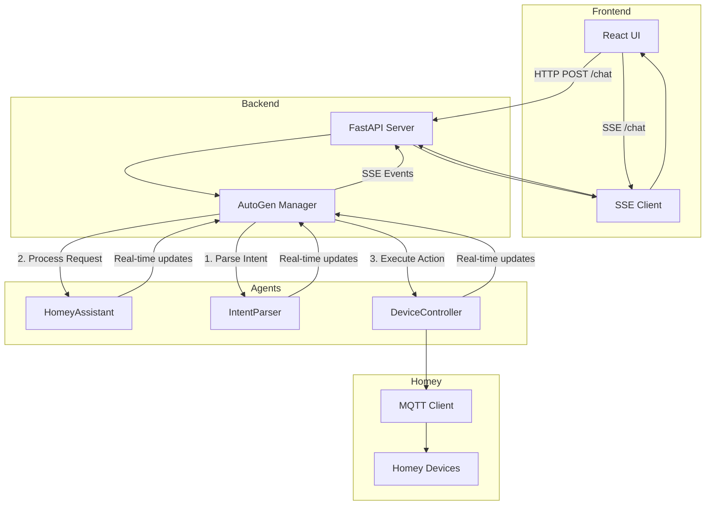

# HomeyMind

Een voice-gestuurde home automation assistent die Homey aanstuurt met behulp van LLMs en AutoGen agents.

## Features

- 🎤 Wake word detectie ("Hey Homey")
- 🤖 LLM-gebaseerde intent herkenning
- 🏠 Homey integratie via MQTT
- 🔊 Text-to-Speech feedback
- 💡 Ondersteuning voor verschillende apparaten (lampen, thermostaat, etc.)
- 🧠 Geheugen voor apparaat status en voorkeuren

### Nieuwe UI Features

- 💬 Real-time chat interface met streaming responses
- 🔄 Live updates van agent communicatie
- 💭 Inzichtelijk denkproces van de agents
- 📱 Responsive design voor desktop en mobiel
- ⚡ Server-Sent Events voor snelle communicatie
- 🎯 Duidelijke weergave van gebruiker en assistent berichten
- 🕒 Tijdstempels voor alle berichten
- 🔍 Uitklapbaar denkproces voor debugging

## Architectuur



## Project Structuur

```
homeymind/
├── app/                  # Core applicatie code
│   ├── core/            # Core functionaliteit
│   │   ├── llm_manager.py   # LLM integratie
│   │   └── memory.py        # Persistent storage
│   └── agents/          # Agent implementaties
│       ├── base_agent.py    # Basis agent klasse
│       ├── homey_assistant.py  # Hoofdassistent
│       ├── device_controller.py # Apparaat aansturing
│       ├── intent_parser.py    # Intent herkenning
│       └── autogen_manager.py  # Agent orchestratie
├── homeymind-ui/        # Frontend applicatie
│   ├── frontend/        # React frontend
│   │   └── src/         # Frontend broncode
│   └── backend/         # FastAPI backend
├── homey/               # Homey integratie
│   ├── mqtt_client.py       # MQTT communicatie
│   ├── device_list.py      # Apparaat management
│   └── intent_parser.py    # Intent parsing
├── audio/               # Audio verwerking
│   ├── recorder.py         # Audio opname
│   ├── transcriber.py      # Speech-to-text
│   └── wake_word_vosk.py   # Wake word detectie
├── tests/               # Test suite
└── docs/                # Documentatie
```

## Setup

1. Clone de repository:
```bash
git clone https://github.com/yourusername/homeymind.git
cd homeymind
```

2. Maak een virtual environment aan:
```bash
python -m venv venv
source venv/bin/activate  # Linux/Mac
# OF
.\venv\Scripts\activate   # Windows
```

3. Installeer dependencies:
```bash
pip install -r requirements.txt
cd homeymind-ui/frontend && npm install
```

4. Configureer de applicatie:
```bash
cp config.example.yaml config.yaml
# Vul de juiste waarden in config.yaml in
```

5. Start de applicatie:

Backend:
```bash
cd homeymind-ui/backend
uvicorn backend:app --reload
```

Frontend:
```bash
cd homeymind-ui/frontend
npm run dev
```

## Gebruik

1. Open de applicatie in je browser op `http://localhost:5173`
2. Type een bericht in de chat interface
3. Bekijk het denkproces van de agents door op "Toon denkproces" te klikken
4. Volg de real-time updates van de agent communicatie
5. Ontvang het uiteindelijke antwoord van de assistent

## Development

### Tests Uitvoeren
```bash
pytest tests/
```

### Code Style
We volgen de PEP 8 standaard voor Python code en gebruiken Prettier voor JavaScript/React code.

## Licentie

[MIT License](LICENSE)
